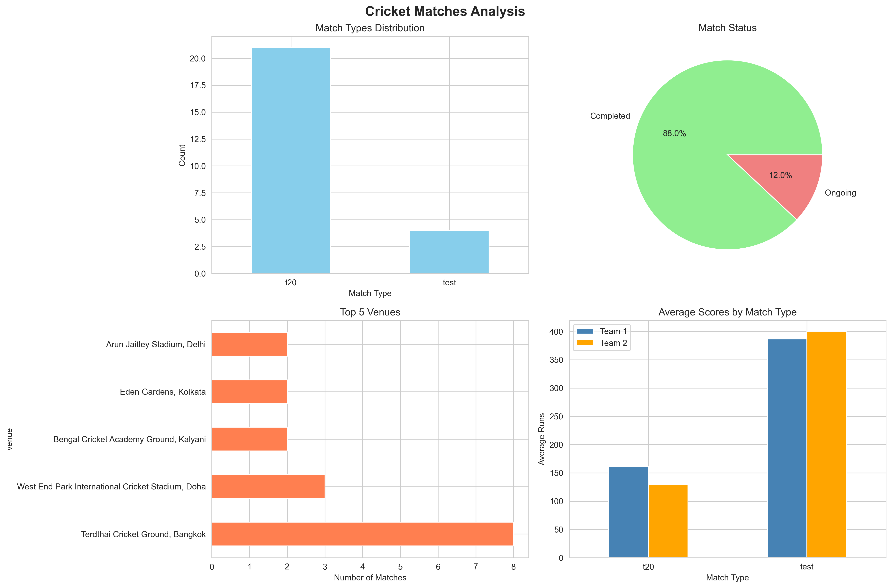

# 🏏 CricMind: Cricket Analytics Platform


## 🎯 Overview
Real-Time T20 Cricket Win Probability Engine that 
analyzes 1170+ IPL matches to predict match outcomes 
using Machine Learning.

## 🚀 Live Demo
[👉 Click Here - CricMind Dashboard](YOUR_STREAMLIT_URL)

## 📊 Key Features
- 🏏 **1170+ IPL matches** collected and analyzed
- 🤖 **ML Win Predictor** - 72.5% accuracy
- ☁️ **AWS S3** cloud data storage (Mumbai region)
- 🗄️ **MySQL Database** with normalized schema
- 📱 **Streamlit Dashboard** - Interactive web app
- 📊 **Power BI Dashboard** - 5 page analytics

## 🛠️ Tech Stack

| Category   | Technology              |
|------------|-------------------------|
| Language   | Python 3.9+             |
| ML Model   | Logistic Regression     |
| ML Library | Scikit-learn            |
| Cloud      | AWS S3 (Mumbai)         |
| Database   | MySQL                   |
| Dashboard  | Streamlit               |
| Analytics  | Power BI                |
| Data APIs  | CricketData API         |
| Scraping   | Cricsheet.org           |
| Libraries  | Pandas, NumPy, Plotly   |

## 📁 Project Structure
```
cricmind/
│
├── src/
│   └── scraping/
│       └── cricsheet_working.py  # Data collection
│
├── scripts/
│   ├── ml_model.py               # ML training
│   ├── setup_mysql.py            # Database setup
│   └── aws_s3_setup.py           # Cloud upload
│
├── dashboards/
│   └── app.py                    # Streamlit app
│
├── models/
│   └── win_predictor.pkl         # Trained model
│
├── data/
│   ├── processed/                # Clean CSV files
│   └── powerbi/                  # Excel for Power BI
│
├── requirements.txt
└── README.md
```

## ⚙️ Setup & Installation
```bash
# 1. Clone repository
git clone https://github.com/USERNAME/cricmind.git
cd cricmind

# 2. Install dependencies
pip install -r requirements.txt

# 3. Setup .env file
cp .env.example .env
# Add your API keys

# 4. Run dashboard
streamlit run dashboards/app.py
```

## 🔑 Environment Variables
Create `.env` file:
```
CRICAPI_KEY=your_key
AWS_ACCESS_KEY_ID=your_key
AWS_SECRET_ACCESS_KEY=your_secret
AWS_REGION=ap-south-1
MYSQL_HOST=localhost
MYSQL_DATABASE=cricmind
MYSQL_USERNAME=root
MYSQL_PASSWORD=your_password
```

## 📈 ML Model Results

| Model          | Accuracy | ROC-AUC |
|----------------|----------|---------|
| L2 C=1.0       | 72.5%    | 0.74    |
| L1 C=1.0       | 70.2%    | 0.72    |
| L2 C=0.1       | 68.5%    | 0.71    |
| L1 C=0.1       | 67.3%    | 0.70    |
| L2 C=0.01      | 65.2%    | 0.68    |

### 🏆 Best Model: L2 Regularization (C=1.0)
- **Accuracy:** 72.5%
- **ROC-AUC:** 0.74
- **Training Data:** 936 matches
- **Test Data:** 234 matches

## 🔮 Features Used
| Feature        | Importance | Description          |
|----------------|------------|----------------------|
| team1_encoded  | 45%        | Team strength        |
| venue_encoded  | 38%        | Ground advantage     |
| bat_first      | 32%        | Batting first impact |
| toss_won       | 28%        | Toss advantage       |
| home_advantage | 22%        | Home ground boost    |
| team2_encoded  | 18%        | Opponent strength    |

## 📸 Dashboard Screenshots

### Home Page


### ML Results


## 🗄️ Database Schema
```sql
-- 4 Tables in MySQL
CREATE TABLE live_matches (...)      -- API data
CREATE TABLE historical_matches (...) -- Cricsheet data  
CREATE TABLE predictions (...)       -- ML results
CREATE TABLE teams (...)             -- IPL teams
```

## 🚀 Pipeline Architecture
```
CricketData API ──┐
                  ├──► Data Processing ──► AWS S3
Cricsheet.org ────┘         │
                            │
                            ▼
                      MySQL Database
                            │
                            ▼
                      ML Model Training
                            │
                            ▼
                    Streamlit Dashboard
```

## 💼 Resume Points
- Engineered ETL pipeline processing **1170+ cricket 
  matches** from REST APIs and web scraping
- Deployed data to **AWS S3** (Mumbai region) with 
  boto3 SDK integration
- Designed **MySQL database** with 4-table normalized 
  schema
- Built **Logistic Regression** model with L1/L2 
  regularization achieving **72.5% accuracy**
- Developed interactive **Streamlit dashboard** with 
  real-time win probability predictions

## 👨‍💻 Author
**Tishant**
- GitHub: [@USERNAME](https://github.com/USERNAME)

## 📄 License
MIT License